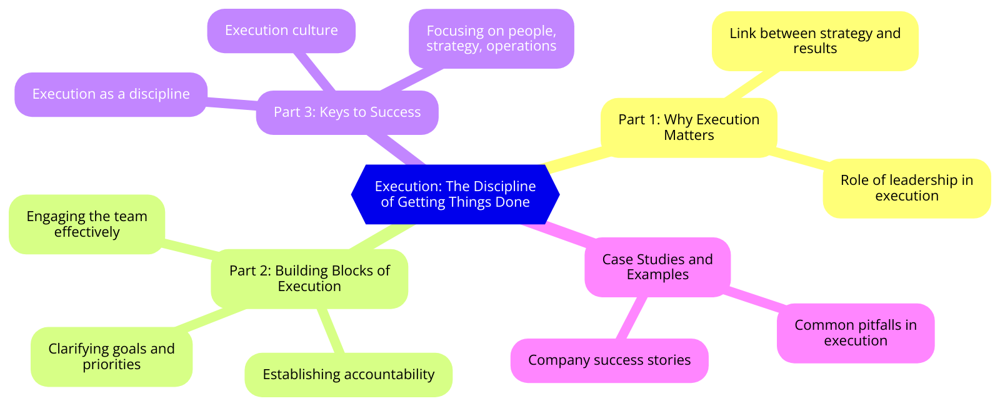

“执行”一书主要讲述了如何在组织和个人层面上更好地落实战略、提高工作效率和实现预定目标。该书的核心观点在于：执行力是企业成功的关键，战略本身并不足够，只有通过有效的执行才能实现目标。书中探讨了三大关键要素：

1. **人员管理**：选择正确的人才，并确保他们在正确的岗位上是执行的基础。
2. **战略执行**：不仅需要制定清晰的战略，还要确保每个员工理解并与之保持一致。
3. **运营管理**：建立有效的日常工作机制，跟踪进展、解决问题、不断优化流程。

通过这些原则，在日常工作中我们可以：

1. **设定明确的目标**：清晰的目标有助于团队理解他们的职责。
2. **跟进并反馈**：定期回顾进展，并及时调整策略。
3. **责任明确**：确保每个人知道自己在执行中的角色和责任。
4. **鼓励沟通与协作**：及时交流信息，跨部门协作可以加快工作进度，避免阻碍。
5. **持续改进**：根据实践中的反馈不断优化工作流程和方法。

通过在日常工作中专注于这些执行细节，我们能够更有效地完成任务，达成预期的目标。

